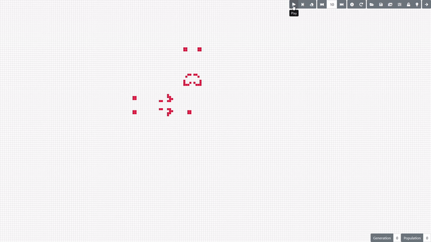

# Game Of Life
 HTML5 version of the cellular automata.  
The application aside from basic automata operations (editing, running, setting different rule strings) is capable of loading file in RLE, Life and MCell formats.

Live version available at [Github Pages](https://tivian.github.io/GameOfLife/).

## Credits
Patterns available in the gallery are from [LifeWiki](https://www.conwaylife.com/wiki/), [Mirek Wojtowicz](http://www.mirekw.com/ca/index.html), [Alan Hensel](http://www.ibiblio.org/lifepatterns/) and [Golly](http://golly.sourceforge.net/).
